# 내 컴퓨터에 개발자용 '작업실' 꾸미기

Codyssey Mission 1 — 개발 워크스테이션 구축

- 저장소: https://github.com/3043382-svg/codyssey_mission1
- 제출자: qreitor

> **작업 디렉토리 표기 안내**
> 로컬 작업 디렉토리명은 `coddyssey_mission1`, 저장소명은 `codyssey_mission1`입니다.
> 스크린샷의 프롬프트 경로와 저장소명이 다른 이유이며, 수행 내용에는 영향이 없습니다.

---

## 1. 프로젝트 개요

macOS 환경에서 개발 워크스테이션을 구축하고, 그 결과를 명령어와 출력으로 검증한 기록입니다.

세 가지를 직접 다뤘습니다.

- **터미널** — 디렉토리 구조 정리, 파일 조작, 권한 변경
- **Docker** — 설치 점검, 운영 명령, 커스텀 이미지 빌드, 포트 매핑, 바인드 마운트, 볼륨
- **Git / GitHub** — 로컬 버전 관리 설정과 원격 저장소 연동

목표는 "따라 친 실습"이 아니라, **같은 서비스를 여러 번 실행해도 동일하게 재현되는 환경**을 만들고 그것을 출력으로 증명하는 것입니다.

---

## 2. 실행 환경

| 항목 | 값 | 증거 |
|---|---|---|
| OS | macOS (Apple Silicon, arm64) | [04](images/04_docker_version.png) |
| Shell | zsh | 전체 스크린샷 프롬프트 |
| 컨테이너 런타임 | OrbStack (Docker Context: `orbstack`) | [04](images/04_docker_version.png) |
| Docker Client | 29.4.0 (API 1.54) | [04](images/04_docker_version.png) |
| Docker Engine | 29.4.0 / linux/arm64 | [04](images/04_docker_version.png) |
| Git | 2.54.0 | [09](images/09_git_config.png) |

**OrbStack을 사용한 이유:** 과제 안내 자료에서 macOS 환경의 Docker 실행 도구로 Docker Desktop과 함께 OrbStack이 언급되어, 더 가볍고 빠르다고 알려진 OrbStack을 선택했습니다. OrbStack 실행 시 내부적으로 Docker 엔진이 함께 구동되며, 터미널에서는 `docker` 명령을 기존과 동일하게 사용할 수 있습니다.

<!-- 위 버전 숫자는 실제 출력과 대조해 확인하십시오. -->

---

## 3. 수행 항목 체크리스트

- [x] 터미널 기본 조작 (위치 확인, 목록 확인, 이동, 생성, 복사, 이름변경, 삭제)
- [x] 파일 내용 확인 및 빈 파일 생성
- [x] 파일 권한 변경 실습 (전/후 비교)
- [x] 디렉토리 권한 변경 실습 (전/후 비교)
- [x] Docker 설치 및 데몬 동작 점검
- [x] Docker 기본 운영 명령 (`images` / `ps` / `ps -a` / `logs` / `stats`)
- [x] `hello-world` 컨테이너 실행
- [x] `ubuntu` 컨테이너 대화형 진입 및 내부 명령 수행
- [x] 컨테이너 종료/유지 차이 관찰
- [x] Dockerfile 기반 커스텀 이미지 제작
- [x] 포트 매핑 및 브라우저 접속 검증
- [x] 바인드 마운트 — 호스트 변경 반영 확인
- [x] Docker 볼륨 — 데이터 영속성 확인
- [x] Git 사용자 정보 및 기본 브랜치 설정
- [x] GitHub 저장소 연동 및 푸시
- [x] VSCode ↔ GitHub 연동
- [x] 민감정보 마스킹

---

## 4. 수행 내용

### 4.1 작업 디렉토리 구성

```bash
mkdir coddyssey_mission1
cd coddyssey_mission1
pwd
ls -la
```

현재 위치 확인(`pwd`)과 숨김 파일을 포함한 목록 확인(`ls -la`)을 함께 수행했습니다.

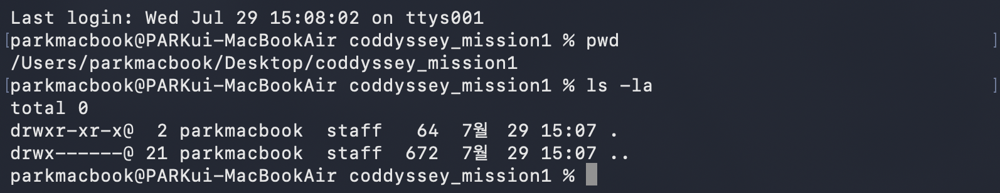

```bash
mkdir images
mkdir practice
ls -la
```

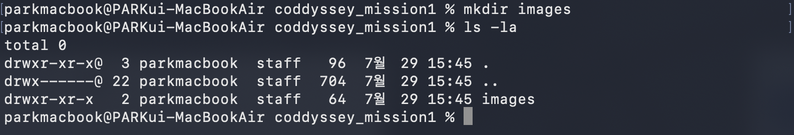
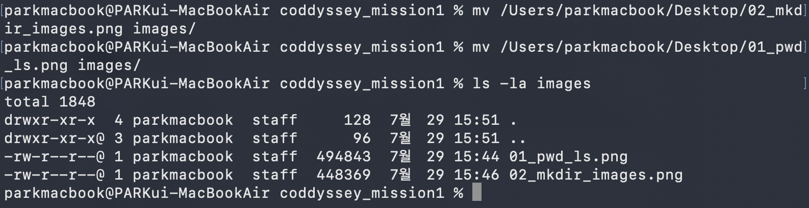

**절대 경로와 상대 경로**

`pwd`가 출력한 `/Users/parkmacbook/Desktop/coddyssey_mission1`은 절대 경로입니다. 최상위 `/`에서 시작하므로, 지금 어느 위치에 있든 항상 같은 곳을 가리킵니다.

반면 `mkdir images`의 `images`는 상대 경로입니다. 현재 위치를 기준으로 해석되므로, 다른 폴더에서 같은 명령을 치면 다른 곳에 폴더가 생깁니다.

| 표기 | 종류 | 의미 |
|---|---|---|
| `/Users/parkmacbook/Desktop/coddyssey_mission1` | 절대 | 루트부터의 전체 경로 |
| `~/Desktop/coddyssey_mission1` | 절대 (홈 확장) | `~`는 홈 디렉토리로 치환됨 |
| `images` | 상대 | 현재 위치 하위의 images |
| `./images` | 상대 | `.`은 현재 디렉토리 |
| `../images` | 상대 | `..`은 상위 디렉토리 |
| `practice/test.txt` | 상대 | 현재 위치 기준 하위 파일 |

이 문서의 스크립트가 상대 경로를 쓰는 이유는 재현성입니다. 절대 경로를 박아두면 사용자명이 다른 다른 컴퓨터에서 그대로 실행되지 않습니다. 4.10의 바인드 마운트에서 `$(pwd)`를 쓴 것도 같은 이유이며, 실행 위치가 저장소 루트여야 한다는 전제가 붙습니다.

### 4.2 빈 파일 생성 및 내용 확인

```bash
touch practice/test.txt
ls -l practice
```

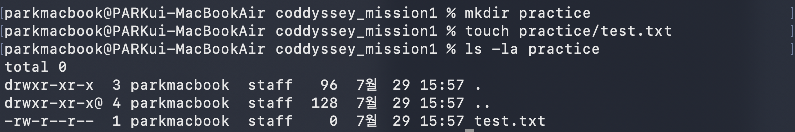

```bash
echo 'Hello Codyssey' > practice/test.txt
cat practice/test.txt
```

zsh에서는 `!`가 히스토리 확장 문자로 해석되므로 작은따옴표를 사용했습니다. (→ 6. 트러블슈팅 #1)

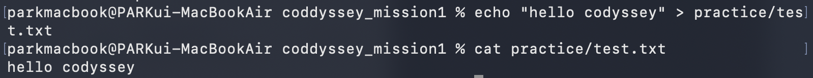

### 4.3 파일 조작 — 복사 / 이름변경 / 삭제

```bash
cp practice/test.txt practice/test-copy.txt
ls -la practice

mv practice/test-copy.txt practice/test-renamed.txt
ls -la practice

rm practice/test-renamed.txt
ls -la practice
```

각 단계마다 `ls -la`로 결과를 확인했습니다.

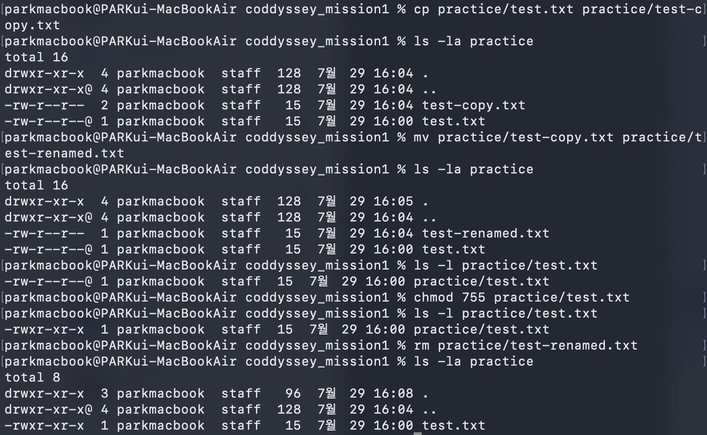

### 4.4 권한 실습

**파일 권한 변경 (전/후 비교)**

```bash
ls -l practice/test.txt
# -rw-r--r--   (644: 소유자 읽기·쓰기, 그룹/기타 읽기)

chmod 755 practice/test.txt
ls -l practice/test.txt
# -rwxr-xr-x   (755: 소유자 읽기·쓰기·실행, 그룹/기타 읽기·실행)
```


**디렉토리 권한 변경 (전/후 비교)**

```bash
ls -ld practice
chmod 700 practice
ls -ld practice
chmod 755 practice
ls -ld practice
```

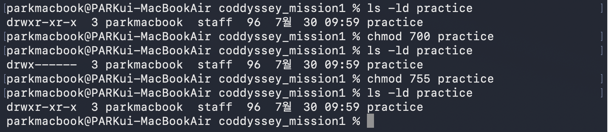

**권한 표기 해석**

세 자리 숫자는 소유자·그룹·기타 순서이며, 각 자리는 읽기(r=4)·쓰기(w=2)·실행(x=1)의 합입니다.

| 표기 | 소유자 | 그룹 | 기타 | 의미 |
|---|---|---|---|---|
| 644 | rw- (6) | r-- (4) | r-- (4) | 일반 파일 기본값 |
| 755 | rwx (7) | r-x (5) | r-x (5) | 실행 파일·디렉토리 기본값 |
| 700 | rwx (7) | --- (0) | --- (0) | 소유자 전용 |

디렉토리의 `x`는 실행이 아니라 **내부 진입 권한**을 뜻합니다. `r`만 있으면 목록은 볼 수 있어도 `cd`가 되지 않습니다.

### 4.5 Docker 설치 및 데몬 동작 점검

```bash
docker version
```

Client와 Server 섹션이 모두 출력되면 CLI 설치와 데몬 구동이 함께 확인됩니다. Context가 `orbstack`으로 표시되는 것이 OrbStack 사용 근거입니다.

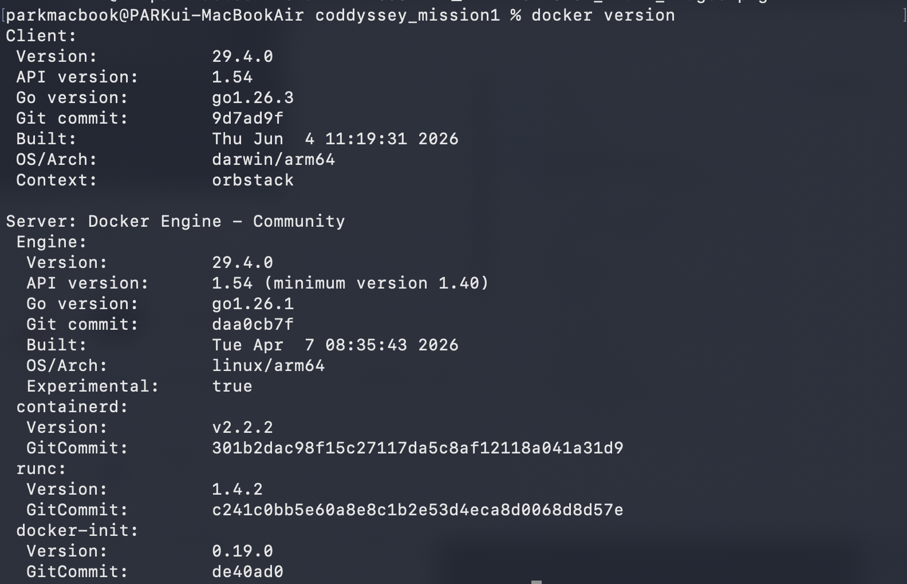

```bash
docker info | head -25
```

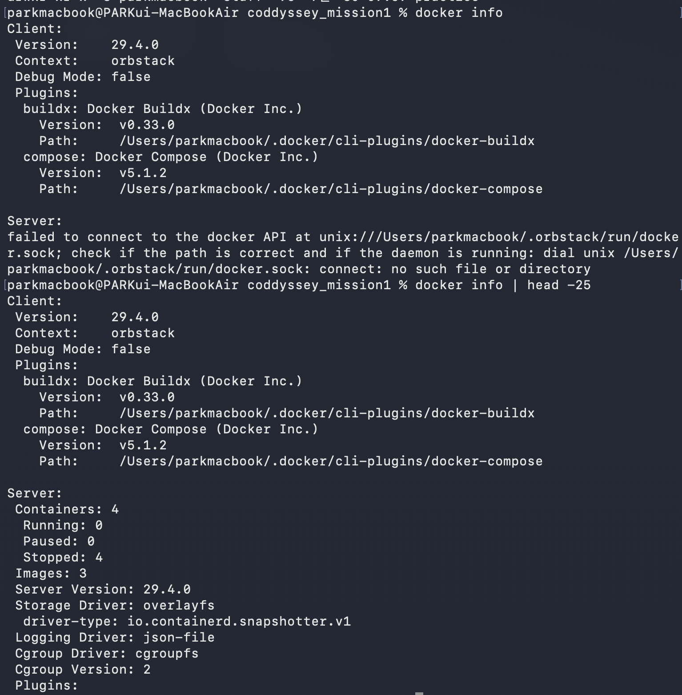

### 4.6 Docker 기본 운영 명령

```bash
docker images                      # 로컬 이미지 목록
docker ps                          # 실행 중 컨테이너
docker ps -a                       # 종료된 컨테이너 포함 전체
docker logs my-web-server | tail -10   # 컨테이너 로그
docker stats --no-stream           # 리소스 사용량
```

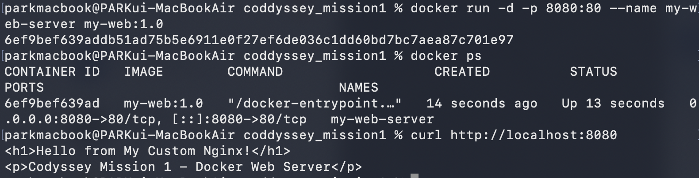

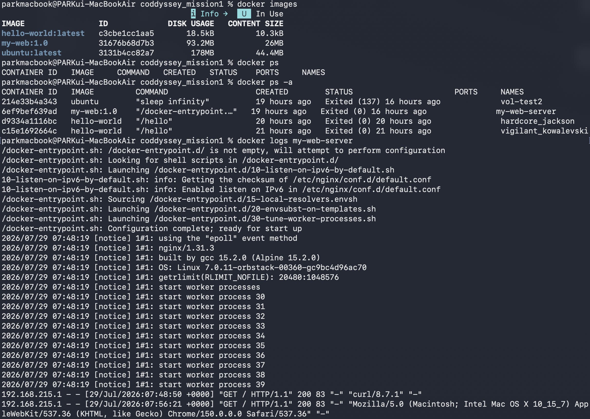
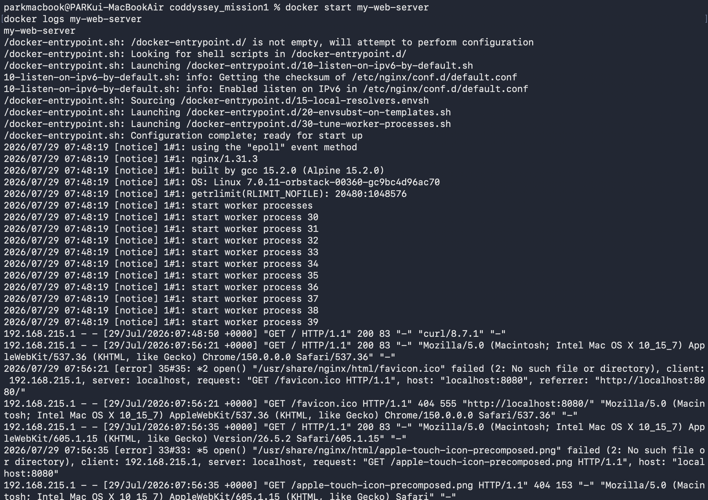
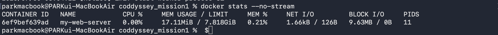

`docker ps`는 실행 중인 컨테이너만, `docker ps -a`는 종료된 컨테이너까지 보여줍니다. 컨테이너는 종료되어도 삭제되지 않고 상태만 `Exited`로 남기 때문에, 정리하지 않으면 계속 누적됩니다.

### 4.7 컨테이너 실행 실습

**hello-world**

```bash
docker run hello-world
```

이미지가 로컬에 없으면 자동으로 레지스트리에서 내려받은 뒤 실행됩니다.

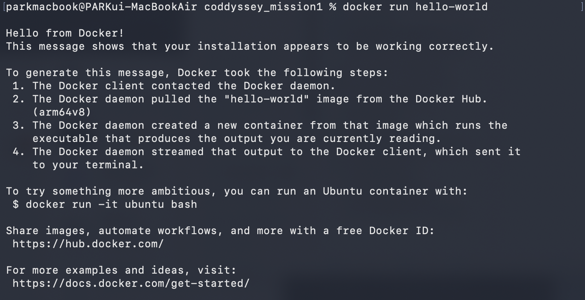

**ubuntu 대화형 진입**

```bash
docker run -it --name ub-test ubuntu bash
# 컨테이너 내부
ls /
echo "hello from container"
exit
```

**종료 / 유지 차이 관찰**

```bash
docker ps -a | grep ub-test        # STATUS: Exited
docker start ub-test               # 다시 실행
docker exec -it ub-test bash -c "echo restarted"
```

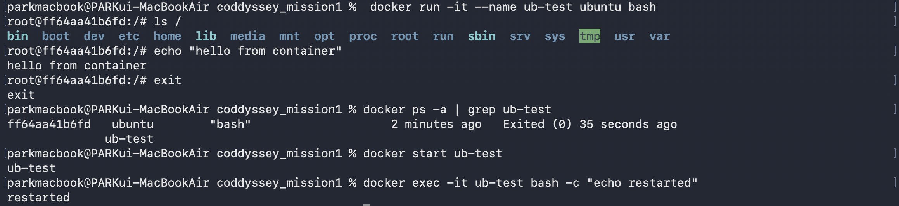

관찰 결과를 정리하면 이렇습니다.

| 명령 | 동작 | 컨테이너 상태 |
|---|---|---|
| `docker run -it ... bash` | 새 컨테이너 생성 후 진입 | 셸 종료 시 `Exited` |
| `docker run -d ...` | 백그라운드 실행 | `Up` 유지 |
| `docker start` | 종료된 컨테이너 재시작 | `Exited` → `Up` |
| `docker exec -it` | 실행 중 컨테이너에 추가 진입 | 변화 없음 |

`run`은 항상 새 컨테이너를 만들고, `exec`는 이미 도는 컨테이너에 붙습니다. 이 차이를 모르면 같은 이미지의 컨테이너가 계속 늘어납니다.

### 4.8 Dockerfile 기반 커스텀 이미지 제작

선택한 방식은 **(A) 웹 서버 베이스 이미지 활용 + 정적 콘텐츠 교체**입니다.

**Dockerfile**

```dockerfile
FROM nginx:alpine
LABEL org.opencontainers.image.title="my-custom-nginx"
COPY index.html /usr/share/nginx/html/index.html
```

**index.html**

```html
<h1>Hello from My Custom Nginx!</h1>
<p>Codyssey Mission 1 - Docker Web Server</p>
```

**커스터마이즈 포인트와 목적**

| 지시어 | 적용 내용 | 목적 |
|---|---|---|
| `FROM nginx:alpine` | Alpine 기반 nginx 선택 | 이미지 크기 최소화. 웹 서버를 직접 설치·설정할 필요 없음 |
| `LABEL` | OCI 표준 title 메타데이터 | 이미지 출처와 용도를 `docker inspect`로 식별 |
| `COPY` | 기본 문서 루트에 index.html 덮어쓰기 | 설정 변경 없이 콘텐츠만 교체 |

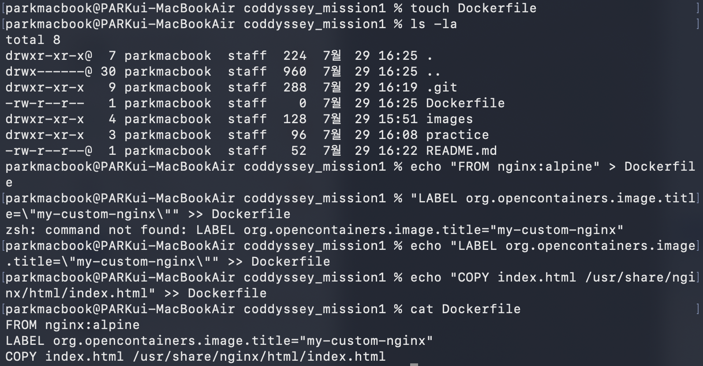
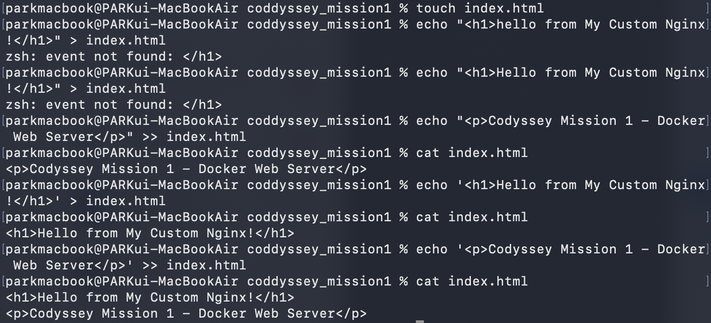

**빌드**

```bash
docker build -t my-web:1.0 .
docker images | grep my-web
```

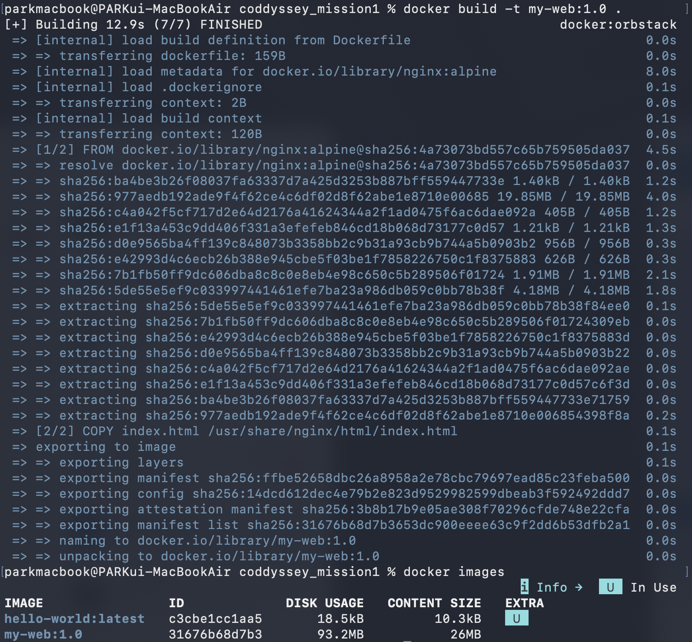

### 4.9 포트 매핑 및 접속 검증

```bash
docker run -d -p 8080:80 --name my-web-server my-web:1.0
docker ps
curl http://localhost:8080
```


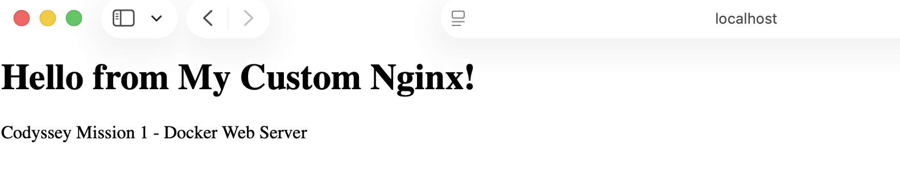

`-p 8080:80`은 호스트 8080 포트를 컨테이너 80 포트로 연결합니다. 컨테이너는 격리된 네트워크 네임스페이스를 갖기 때문에, 이 매핑이 없으면 컨테이너 내부에서 nginx가 정상 동작해도 호스트 브라우저에서는 접속할 수 없습니다. 컨테이너 내부 포트는 그대로 두고 호스트 포트만 바꾸면, 같은 이미지를 여러 포트에서 동시에 띄울 수 있습니다.

### 4.10 바인드 마운트 — 변경 반영

```bash
docker run -d -p 8081:80 \
  -v "$(pwd)":/usr/share/nginx/html \
  --name bind-test nginx:alpine

# 브라우저 localhost:8081 접속 → 변경 전 화면 캡처
# 호스트에서 index.html 수정
# 브라우저 새로고침 → 변경 후 화면 캡처
```

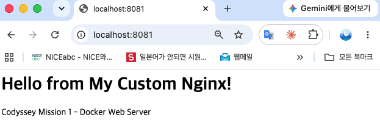


이미지를 다시 빌드하지 않아도 호스트 파일 수정이 즉시 반영됩니다. 개발 중에는 이 방식이, 배포 시에는 `COPY`로 이미지에 굽는 방식이 적합합니다.

### 4.11 볼륨 — 데이터 영속성

```bash
docker volume create mydata

docker run -d --name vol-test -v mydata:/data ubuntu sleep infinity
docker exec vol-test bash -c "echo hello > /data/hello.txt"
docker exec vol-test cat /data/hello.txt
# hello

docker rm -f vol-test

docker run -d --name vol-test2 -v mydata:/data ubuntu sleep infinity
docker exec vol-test2 cat /data/hello.txt
# hello
```

컨테이너를 강제 삭제한 뒤 새 컨테이너에 같은 볼륨을 연결했고, 파일이 그대로 남아 있었습니다. 컨테이너의 쓰기 레이어는 삭제와 함께 사라지지만, 볼륨은 컨테이너 생애주기와 분리되어 관리됩니다.

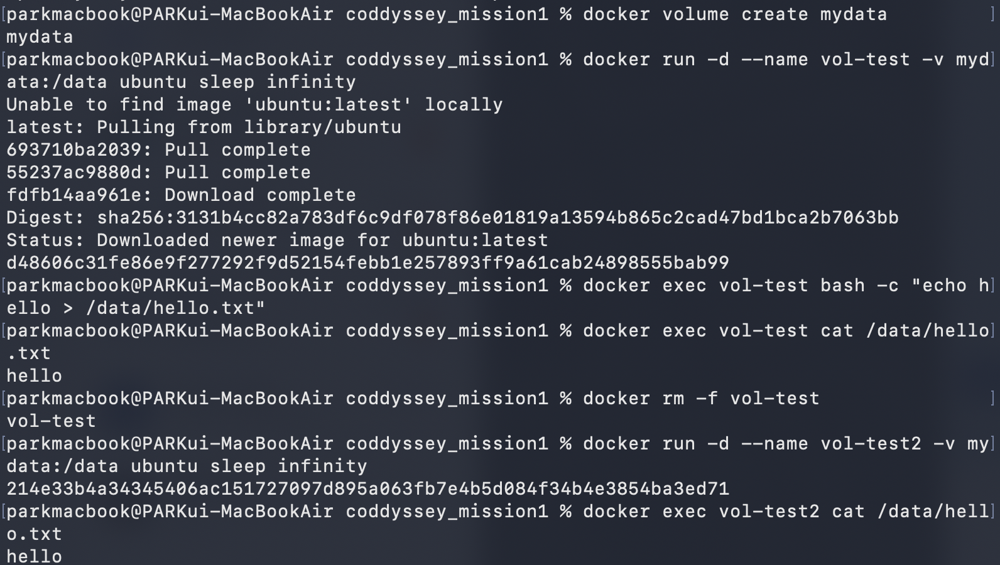

**바인드 마운트와 볼륨의 차이**

| 구분 | 저장 위치 | 주 용도 |
|---|---|---|
| 바인드 마운트 | 호스트의 지정 경로 | 개발 중 소스 즉시 반영 |
| 볼륨 | Docker가 관리하는 영역 | 운영 데이터 영속 보관 |

### 4.12 Git 설정 및 GitHub 연동

```bash
git --version
git config --global user.name "***"
git config --global user.email "***@***"
git config --global init.defaultBranch main
git config --global --list
```

`git config --global --list` 출력에서 사용자 정보는 마스킹했습니다.

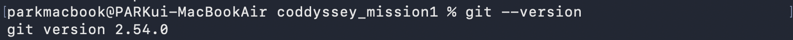

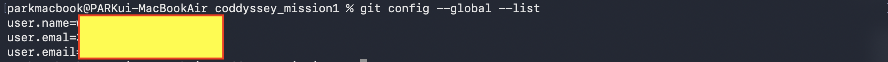

```bash
git init
git add .
git commit -m "첫 번째 커밋: 개발환경 구축 과제"
```

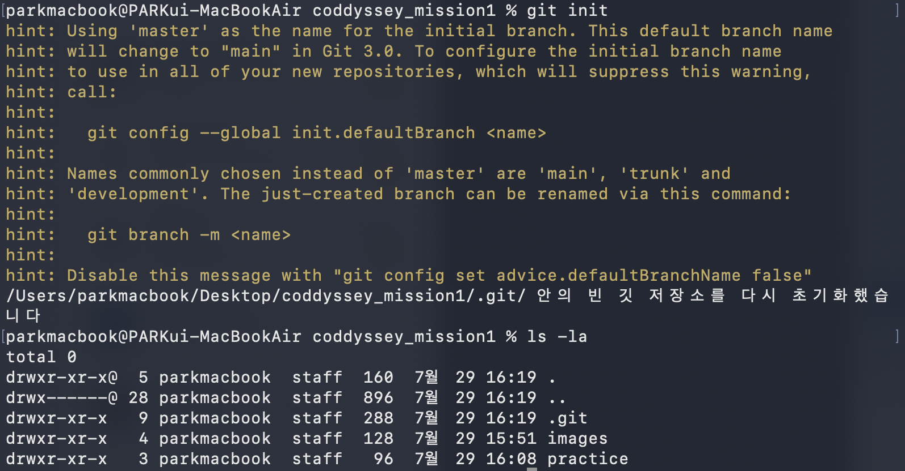
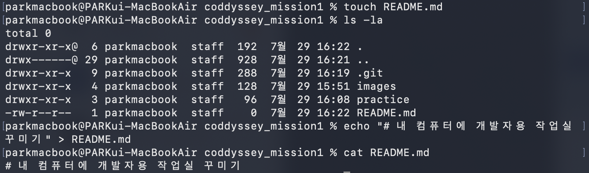

```bash
git remote add origin https://github.com/3043382-svg/codyssey_mission1.git
git branch -M main
git push -u origin main
```

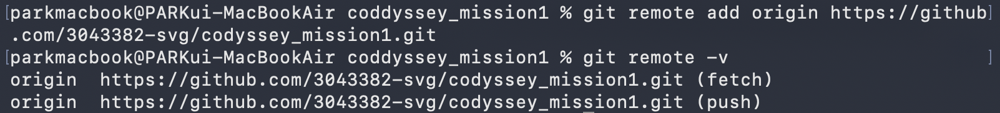
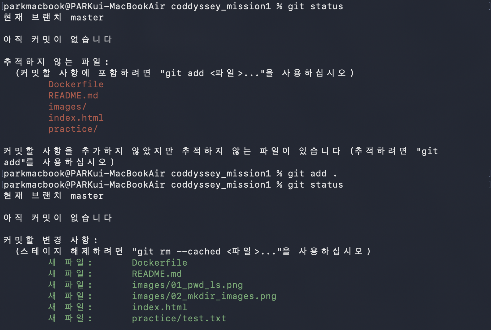
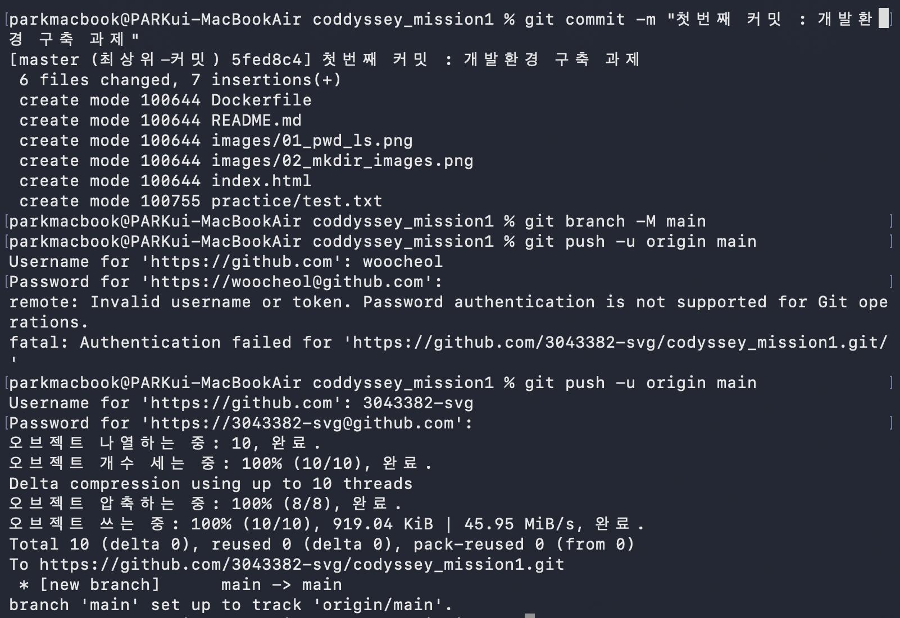

**VSCode ↔ GitHub 연동**

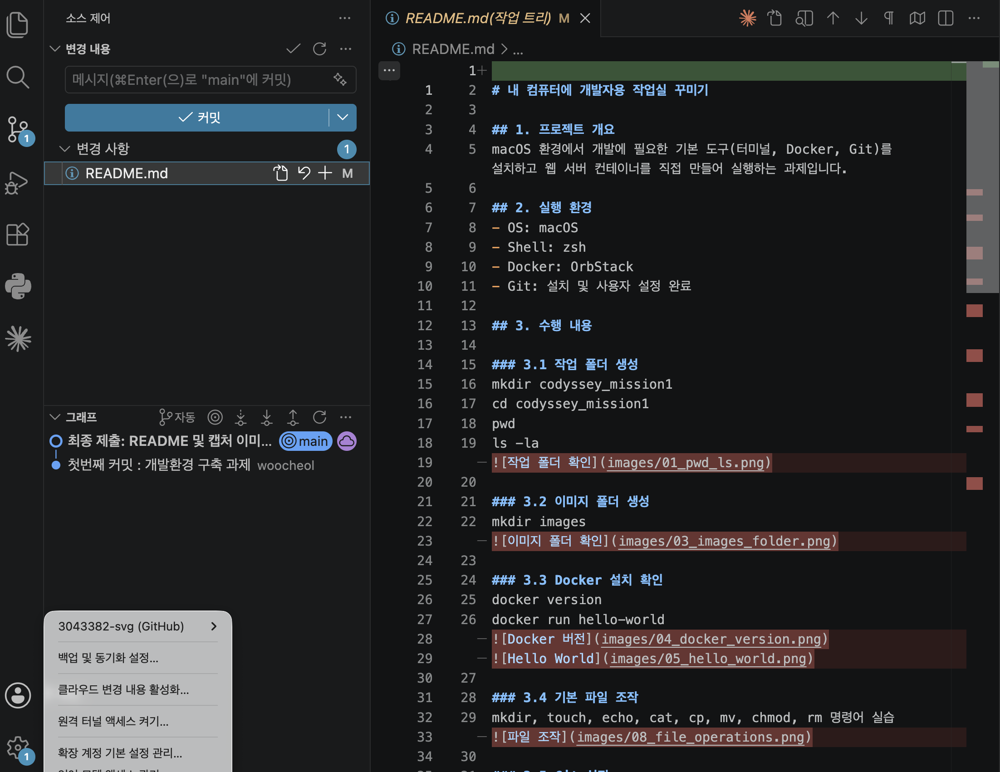

**Git과 GitHub의 역할 차이**

Git은 내 컴퓨터에서 동작하는 버전 관리 도구입니다. 커밋 이력은 네트워크 없이도 로컬에 쌓입니다. GitHub는 그 이력을 올려두고 공유·리뷰·협업하는 원격 플랫폼입니다. `git commit`까지는 나 혼자의 기록이고, `git push`부터 남과 공유되는 기록입니다.

---

## 5. 검증 방법 및 증거 위치

| 검증 항목 | 검증 명령 | 확인 내용 | 증거 |
|---|---|---|---|
| 터미널 조작 | `pwd` / `ls -la` | 위치·숨김 파일 포함 목록 | [01](images/01_pwd_ls.png) |
| 파일 조작 | `cp` / `mv` / `rm` + `ls -la` | 각 단계 목록 변화 | [08](images/08_file_operations.png) |
| 파일 권한 | `chmod 755` 전후 `ls -l` | `-rw-r--r--` → `-rwxr-xr-x` | [08](images/08_file_operations.png) |
| 디렉토리 권한 | `chmod 700` 전후 `ls -ld` | 권한 문자열 변화 | [20](images/20_chmod_dir.png) |
| Docker 설치 | `docker version` | Client·Server 동시 출력 | [04](images/04_docker_version.png) |
| Docker 데몬 | `docker info` | 데몬 응답 및 설정 | [21](images/21_docker_info.png) |
| 운영 명령 | `images`/`ps -a`/`logs`/`stats` | 목록·상태·로그·리소스 | [22-1](images/22_docker_ops1.png), [22-2](images/22_docker_ops2.png), [22-3](images/22_docker_ops3.png) |
| 컨테이너 실행 | `docker run hello-world` | 실행 성공 메시지 | [05](images/05_hello_world.png) |
| 컨테이너 진입 | `docker run -it ubuntu bash` | 내부 `ls`·`echo` 결과 | [23](images/23_ubuntu_interactive.png) |
| 이미지 빌드 | `docker build` | 빌드 성공 및 이미지 생성 | [14](images/14_docker_build.png) |
| 포트 매핑 | `curl localhost:8080` + 브라우저 | HTML 응답 및 주소창 | [15](images/15_browser.png), [16](images/16_browser.png) |
| 바인드 마운트 | 호스트 파일 수정 + 새로고침 | 재빌드 없이 반영 | [24](images/24_bind_before.png), [25](images/25_bind_after.png) |
| 볼륨 영속성 | `rm -f` 후 신규 컨테이너 조회 | 파일 유지 확인 | [17](images/17_volume_persist.png) |
| Git 설정 | `git config --global --list` | 사용자·기본 브랜치 설정 | [26](images/26_git_config_list.png) |
| GitHub 연동 | `git push -u origin main` | 원격 반영 성공 | [18](images/18_git_remote.png), [19](images/19_git_push1.png) |
| VSCode 연동 | VSCode 소스 제어 패널 | GitHub 로그인·저장소 연결 | [27](images/27_vscode_github.png) |

---

## 6. 트러블슈팅

### #1 zsh에서 `echo`에 `!`를 넣으면 오류

- **문제** — `echo "Hello!" > test.txt` 실행 시 `event not found` 오류로 명령이 실패했습니다.
- **원인 가설** — zsh의 히스토리 확장 기능이 `!`를 이전 명령 참조 문자로 해석하는 것으로 추정했습니다.
- **확인** — 큰따옴표 대신 작은따옴표로 감싸 실행하니 오류가 사라졌습니다. 히스토리 확장은 작은따옴표 안에서 동작하지 않습니다.
- **해결 / 대안** — 특수문자를 포함한 문자열은 작은따옴표를 사용했습니다. 대안으로 `setopt nobanghist`로 기능을 끄거나 `\!`로 이스케이프할 수 있습니다.

### #2 GitHub HTTPS 푸시에서 비밀번호 인증 거부

- **문제** — `git push` 시 계정 비밀번호를 입력했으나 인증이 거부되었습니다.
- **원인 가설** — GitHub가 HTTPS 방식의 비밀번호 인증을 종료했기 때문으로 추정했습니다.
- **확인** — 오류 메시지에서 비밀번호 인증이 지원되지 않는다는 안내와 토큰 사용 안내를 확인했습니다.
- **해결 / 대안** — Personal Access Token을 발급해 비밀번호 자리에 입력했습니다. 대안은 SSH 키 등록 후 SSH 원격 주소 사용입니다. 토큰 값은 문서·스크린샷에 남기지 않았습니다.

### #3 OrbStack이 꺼져 있어 Docker 데몬 연결 실패

- **문제** — `docker info` 실행 시 Client 정보는 정상 출력됐지만, Server 항목에서 `failed to connect to the docker API at unix:///Users/.../.orbstack/run/docker.sock ... no such file or directory` 오류가 발생했습니다.
- **원인 가설** — Client(CLI)는 정상 동작하지만 Server(Docker 엔진 본체)가 응답하지 않는 것으로 보아, OrbStack 앱 자체가 실행되어 있지 않거나 데몬이 종료된 상태로 판단했습니다.
- **확인** — 메뉴바에서 OrbStack이 실행 중이지 않은 것을 확인했습니다.
- **해결 / 대안** — OrbStack 앱을 다시 실행하고 데몬이 완전히 기동될 때까지 기다린 뒤 `docker info`를 재실행하니 Server 정보까지 정상 출력되었습니다. 이 경험으로 Client 연결과 Server(데몬) 동작은 별개로 점검해야 한다는 것을 확인했습니다.

### #4 바인드 마운트 경로 오타로 인한 컨테이너 이름 충돌

- **문제** — 바인드 마운트 컨테이너 실행 시 컨테이너 경로를 `/usr/shaare/nginx/html`로 오타를 냈습니다. 명령 자체는 오류 없이 컨테이너를 생성했으나, 잘못된 경로로 마운트되어 `index.html`이 반영되지 않는 상태였습니다. 오타를 고쳐 재실행하자 이번에는 `Conflict. The container name "/bind-test" is already in use` 오류가 발생했습니다.
- **원인 가설** — 첫 실행이 에러 없이 성공했기 때문에 오타를 인지하지 못했고, 같은 이름(`bind-test`)의 컨테이너가 이미 존재하는 상태에서 동일 이름으로 재생성을 시도해 충돌한 것으로 판단했습니다.
- **확인** — `docker ps -a`로 `bind-test`라는 이름의 컨테이너가 이미 존재함을 확인했습니다.
- **해결 / 대안** — `docker rm -f bind-test`로 기존 컨테이너를 삭제한 뒤, 경로 철자를 재확인하고 재실행해 정상 반영을 확인했습니다. 이 사례로, `docker run`이 에러 없이 끝나는 것과 "의도한 대로 동작하는 것"은 별개이며 마운트 경로처럼 조용히 실패하는 설정은 결과를 직접 눈으로 확인해야 한다는 점을 확인했습니다.

### #5 `ubuntu:latest` 이미지가 로컬에 없어 실행이 지연됨

- **문제** — 볼륨 실습에서 `docker run ... ubuntu` 실행 시 즉시 시작되지 않았습니다.
- **원인 가설** — 해당 이미지가 로컬에 없어 원격에서 내려받는 중이라고 추정했습니다.
- **확인** — 출력에 로컬에서 이미지를 찾을 수 없다는 메시지와 레이어 다운로드 진행 상황이 표시되었습니다.
- **해결 / 대안** — 다운로드 완료 후 정상 실행되었습니다. 반복 실습 시에는 `docker pull ubuntu`로 미리 받아두면 실행 시점의 지연을 없앨 수 있습니다.
